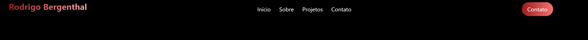
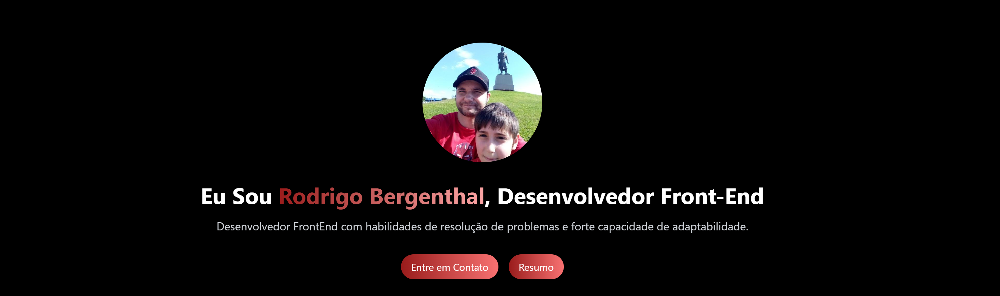
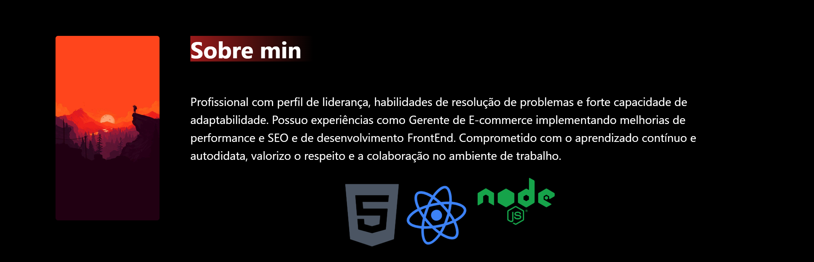
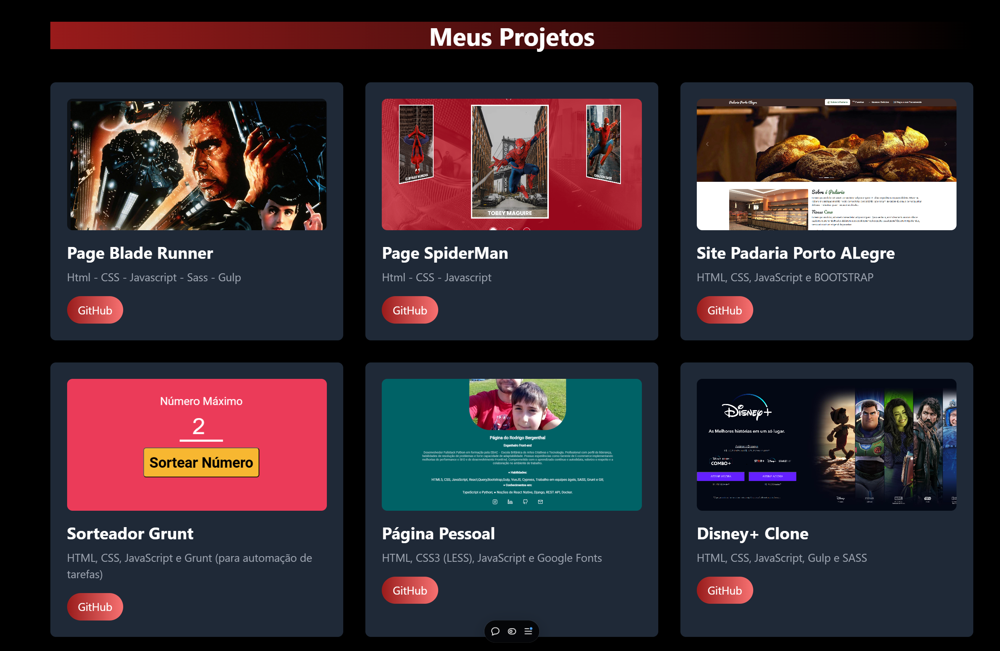
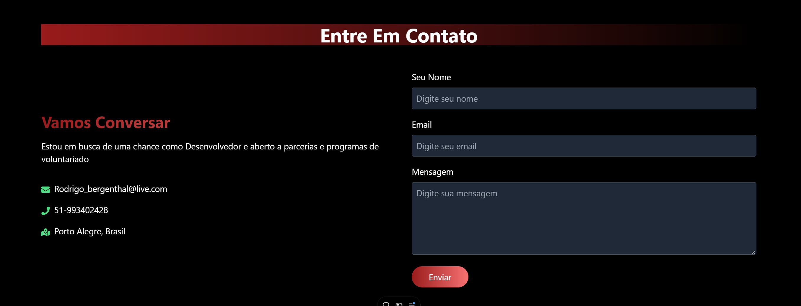

# React + Vite + Tailwind CSS com animações

# PUBLICADO NA VERCEL : https://rodrigobergenthal.vercel.app/


Este é um projeto de portfólio pessoal criado utilizando React, Vite e Tailwind CSS. O objetivo deste projeto é mostrar minhas habilidades em desenvolvimento web moderno, incluindo a importação de ícones, animações e componentes bem estruturados.

## Estrutura do Projeto

O projeto está organizado da seguinte forma:

- **src**: Pasta principal onde estão localizados todos os componentes principais e arquivos de estilo.
  - **components**: Contém todos os componentes reutilizáveis, como Navbar, Hero, About, Projects e Contact.
  - **App.jsx**: Arquivo que inicializa a aplicação e importa todos os componentes necessários.
  - **index.css** e **App.css**: Arquivos de estilo global.

## Dependências Utilizadas

- **React**: Biblioteca para construção de interfaces de usuário.
- **Vite**: Bundler moderno com foco em velocidade e simplicidade.
- **Tailwind CSS**: Framework CSS utilitário para design responsivo e estilização rápida.
- **React Icons**: Para adicionar ícones personalizados ao projeto.
- **Autoprefixer** e **PostCSS**: Para processamento de estilos com suporte a browsers antigos.
- **Tailwind CSS Animated**: Extensão para animações no Tailwind CSS.

## Instalação

1. Clone o repositório:
    ```bash
    git clone https://github.com/rodrigobergenthal/portifolio-react-e-taiwind---vite.git
    cd portifolio-react-e-taiwind---vite
    ```

2. Instale as dependências:
    ```bash
    npm install
    ```

3. Execute o projeto em modo de desenvolvimento:
    ```bash
    npm run dev
    ```

## Estrutura dos Componentes

### Navbar

Componente responsável pela barra de navegação no topo da aplicação, contendo links para as diferentes seções do portfólio.



### Hero

Seção principal que apresenta uma mensagem de boas-vindas e um botão para entrar em contato.



### About

Uma seção sobre mim, onde explico brevemente sobre minhas habilidades e experiências.



### Projects

Lista de projetos que eu desenvolvi, cada um com uma breve descrição e imagens representativas.



### Contact

Formulário para contato, onde os visitantes podem enviar mensagens diretamente para mim.



## Personalização e Estilos

O projeto utiliza Tailwind CSS para estilização, permitindo uma rápida e eficiente criação de designs responsivos. As animações são aplicadas usando a biblioteca `tailwindcss-animated`.

## Contribuições

Sinta-se à vontade para contribuir com melhorias no código, adicionar novos componentes ou corrigir bugs. Todas as contribuições são bem-vindas!

## Licença

Este projeto é licenciado sob a MIT License - veja o arquivo [LICENSE](LICENSE) para mais detalhes.

---

- [@vitejs/plugin-react](https://github.com/vitejs/vite-plugin-react/blob/main/packages/plugin-react/README.md) uses [Babel](https://babeljs.io/) for Fast Refresh
- [@vitejs/plugin-react-swc](https://github.com/vitejs/vite-plugin-react-swc) uses [SWC](https://swc.rs/) for Fast Refresh
